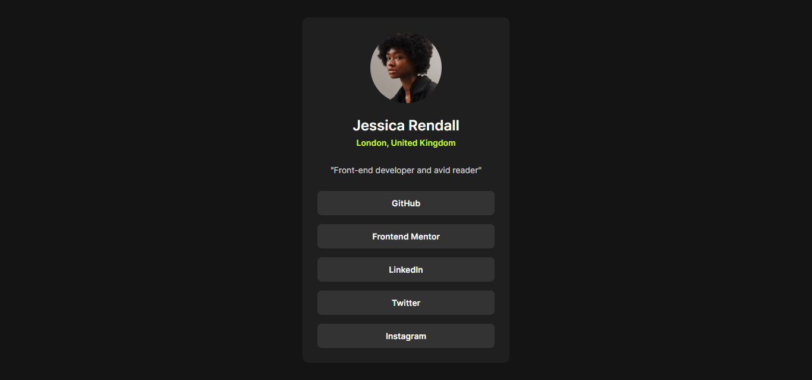

# Frontend Mentor - Social Profile Links Solution

This is a solution to the [Social profile links challenge on Frontend Mentor](https://www.frontendmentor.io/challenges/social-links-profile-UG32l9m6dQ).

## Table of contents

- [Overview](#overview)
  - [Screenshot](#screenshot)
  - [Links](#links)
- [My process](#my-process)
  - [Built with](#built-with)
  - [What I learned](#what-i-learned)
- [Author](#author)

## Overview

### Screenshot

### Links

- Solution URL: [Github Link]()
- Live Site URL: [Live site]()

## My process

### Built with

- HTML5 markup
- Flexbox

### What I learned

I learnt about the flex basis property while building this project. I always taught that flex basis was meant to be used on the parent, but now I know that it is a property meant for the child

## Author

- Frontend Mentor - [Kansoldev](https://www.frontendmentor.io/profile/Kansoldev)
- Twitter - [Kansoldev](https://www.twitter.com/Kansoldev)
